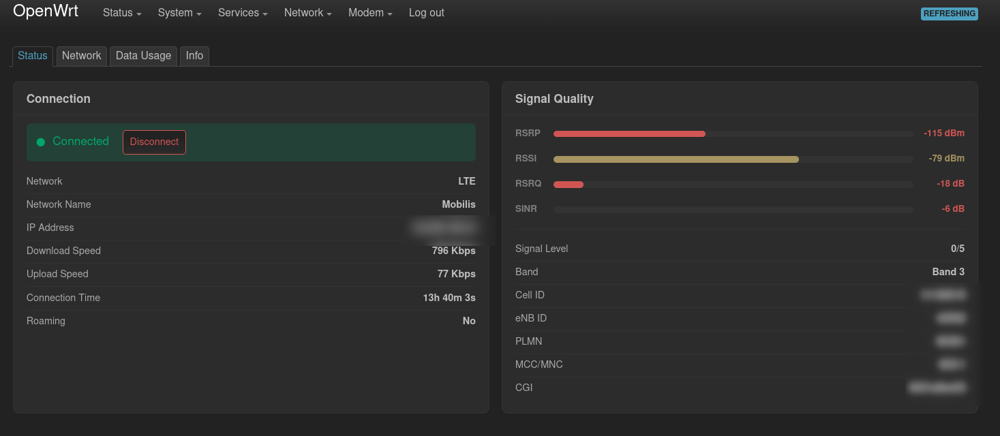

<div align="center">

# luci-app-hh4xmodem

**A LuCI interface for the MDM9207 modem in HH40V / HH41V routers.**

[](https://openwrt.org/)
[](https://github.com/openwrt/luci)
[](LICENSE)
[](https://github.com/devopnem/luci-app-hh4xmodem/releases/latest)
[](#donate)

Monitor signal, switch network modes, manage SMS, USSD codes and call logs — straight
from LuCI, over the modem's local HTTP API. No cloud, no external services.

</div>

---

## Screenshots

### Dashboard — Signal & Connection



<div align="center"><sub>Live signal quality (RSRP / RSSI / RSRQ / SINR), band, cell identity and connection state.</sub></div>

The dashboard has four tabs:

| Tab | What it shows |
| --- | --- |
| **Status** | Connect/disconnect, network type, operator, IP, up/down speed, uptime, signal bars, band, cell ID, eNB ID, PLMN, MCC/MNC |
| **Network** | Preferred network mode selection, band selection, APN profiles, connection mode |
| **Data Usage** | Session totals and upload/download counters, with the ability to reset them |
| **Info** | Firmware, IMEI, model, SIM state (including PIN/PUK unlock) and modem utilities |

---

## Features

- **Connection control** — connect and disconnect the data session, start/stop auto-connect.
- **Signal monitoring** — RSRP, RSSI, RSRQ and SINR with colour-graded bars, plus signal level, band, cell ID, eNB ID, PLMN and MCC/MNC.
- **Network mode selection** — 2G only, 3G only, 2G/3G auto, LTE only, 2G/3G auto with 4G fallback, 3G/4G auto, or full auto (recommended).
- **Data usage tracking** — upload and download counters with configurable reset periods, resettable from the UI.
- **SMS** — read inbox, sent, drafts and outbox, read individual messages, send new ones, delete single or bulk.
- **USSD** — run USSD codes such as balance and data-remaining checks, with proper session handling.
- **Call log** — missed, received, dialled and combined call history with paging.
- **SIM & modem maintenance** — PIN/PUK unlock, PIN change and enable/disable, modem reboot/reset, profile (APN) add/edit/delete/default.
- **Auto-refresh** — configurable poll interval, so the dashboard stays current without reloading.
- **No external dependencies** — talks to the modem's built-in HTTP API through `ucode` + `rpcd`, which LuCI already ships.

---

## Requirements

| | |
| --- | --- |
| **Router** | **HH40V** or **HH41V** (Qualcomm **MDM9207** modem) |
| **Firmware** | OpenWrt with LuCI, `23.05` and newer (developed and tested on `25.12`) |
| **Packages** | `luci-base`, `ucode-mod-socket` — pulled in automatically |

---

## Installation

### Option 1 — prebuilt package (recommended)

Download the latest `.apk` from the [releases page](https://github.com/devopnem/luci-app-hh4xmodem/releases/latest)
and install it on the router:

```sh
# OpenWrt 25.12+ (apk)
apk add --allow-untrusted luci-app-hh4xmodem-1.0.0-r1.apk

# Older releases (opkg)
opkg install luci-app-hh4xmodem-1.0.0-r1.apk
```

Or fetch it directly over SSH:

```sh
wget -O /tmp/hh4xmodem.apk \
  https://github.com/devopnem/luci-app-hh4xmodem/releases/latest/download/luci-app-hh4xmodem-1.0.0-r1.apk
apk add --allow-untrusted /tmp/hh4xmodem.apk
```

### Option 2 — add as a feed

This repository is a single package, so its `Makefile` sits at the repository root rather
than in a subdirectory. `./scripts/feeds install` does not index root-level packages, so
link it into `package/` manually:

```sh
# feeds.conf.default
src-link hh4x https://github.com/devopnem/luci-app-hh4xmodem.git
```

```sh
./scripts/feeds update hh4x
mkdir -p package/luci-apps
ln -s ../../feeds/hh4x package/luci-apps/luci-app-hh4xmodem
make package/luci-app-hh4xmodem/compile V=s
```

> `feeds update` prints a couple of `grep: ... No such file or directory` warnings while
> scanning this feed. They are harmless and the package builds normally.

To have the package built into your firmware image, run `make menuconfig` and select
**LuCI → 3. Applications → luci-app-hh4xmodem**.

### Option 3 — build from source

Clone straight into the buildroot and build it:

```sh
git clone https://github.com/devopnem/luci-app-hh4xmodem.git \
    package/luci-apps/luci-app-hh4xmodem
make package/luci-app-hh4xmodem/compile V=s
```

The resulting package lands in `bin/packages/*/*/luci-app-hh4xmodem-*.apk`.

### Finish up

```sh
/etc/init.d/rpcd restart
/etc/init.d/uhttpd restart
```

Then open **LuCI → Services → Modem** (or **Modem** in the top menu). The first boot
runs `etc/uci-defaults/80_hh4xmodem`, which creates `/etc/config/hh4xmodem`.

---

## Configuration

All settings live in `/etc/config/hh4xmodem`:

```sh
uci show hh4xmodem
```

| Option | Default | Description |
| --- | --- | --- |
| `settings.modem_ip` | `192.168.225.1` | IP address of the modem's HTTP API |
| `settings.modem_port` | `2016` | Port of the modem's HTTP API |
| `settings.refresh_interval` | `3` | Dashboard auto-refresh interval, in seconds |

```sh
uci set hh4xmodem.settings.refresh_interval='5'
uci commit hh4xmodem
/etc/init.d/rpcd restart
```

---

## Troubleshooting

**The page shows "modem unreachable" or an empty dashboard.**
The modem HTTP API must be reachable from the router. Check that the modem is powered
and that the IP/port above are correct:

```sh
ping -c3 192.168.225.1
wget -qO- http://192.168.225.1:2016/cgi-bin/status
```

If the modem sits on another address, change `settings.modem_ip` accordingly.

**Menus do not appear after installing.**
Refresh rpcd and clear LuCI's cache:

```sh
rm -f /tmp/luci-indexcache
/etc/init.d/rpcd restart
/etc/init.d/uhttpd restart
```

**`Permission denied` on an RPC call.**
Log in as `root` — the ACL file only grants access to the `luci-app-hh4xmodem`
capability, which administrators have by default. Check it exists at
`/usr/share/rpcd/acl.d/luci-app-hh4xmodem.json`.

**Values look stale.**
The modem takes a few seconds to answer after a mode switch or reboot. Wait for the
modem to re-register on the network, then refresh.

---

## Donate

<div align="center">

This project is free and always will be. It is developed and tested on real
HH40V / HH41V hardware, which costs money to buy, and spare units to keep around.

If it saved you some time, a small donation helps fund the next device.

**USDT on Tron (TRC20)**

</div>

<p align="center">
  
</p>

```text
TTGuQF2zyJNsNJrUBfCxazbK8e9v7qkMLk
```

<p align="center">
  <a href="https://redotpay.com/"></a>
</p>

<div align="center">

Network: **TRON (TRC20)** · Asset: **USDT**
Send **only USDT on TRC20** to this address — other assets or networks will be lost.

</div>

Donations are voluntary and never affect support. Questions about a payment, open an issue.

---

## Contributing

Issues and pull requests are welcome — bug reports especially, since this package is
developed against real hardware.

```sh
git clone https://github.com/devopnem/luci-app-hh4xmodem.git
cd luci-app-hh4xmodem
# edit htdocs/luci-static/resources/view/hh4xmodem/ (LuCI views)
#      root/usr/share/rpcd/ucode/hh4xmodem.uc        (rpcd backend)
#      root/usr/bin/                                 (AT helpers)
```

Keep changes focused, match the existing tab-indent style, and describe what you tested
on (router model, firmware, modem revision).

## Credits

- The [OpenWrt](https://openwrt.org/) project and the [LuCI](https://github.com/openwrt/luci) project.
- The community reverse-engineering work on the MDM9207 HTTP API that made this possible.
- Extracted from the [`devopnem/luci`](https://github.com/devopnem/luci) fork, where this
  app originally lived under `applications/luci-app-hh4xmodem`.

## License

[Apache License 2.0](LICENSE) © 2026 HH4xModem

## Maintainer

**Devon Openheim** — [@devopnem](https://github.com/devopnem)